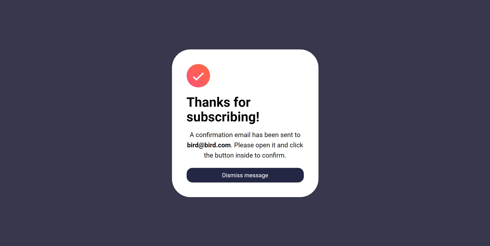

# React Form with Email Validation Challenge

My personal solution of Frontend mentor [Newsletter sign-up form with success message](https://www.frontendmentor.io/challenges/newsletter-signup-form-with-success-message-3FC1AZbNrv) challenge

## Demo

A live demo of this project can be accessed [here](https://www.example.com).

## Features

- Responsive form layout with a single email input field.
- Real-time validation of the email address using React Hook Form.
- Displays error messages when the email format is incorrect.
- Submits the form data when the email is valid.
- Styled with Tailwind CSS 

## Technologies Used

- React
- Tailwind CSS
- React Hook Form

